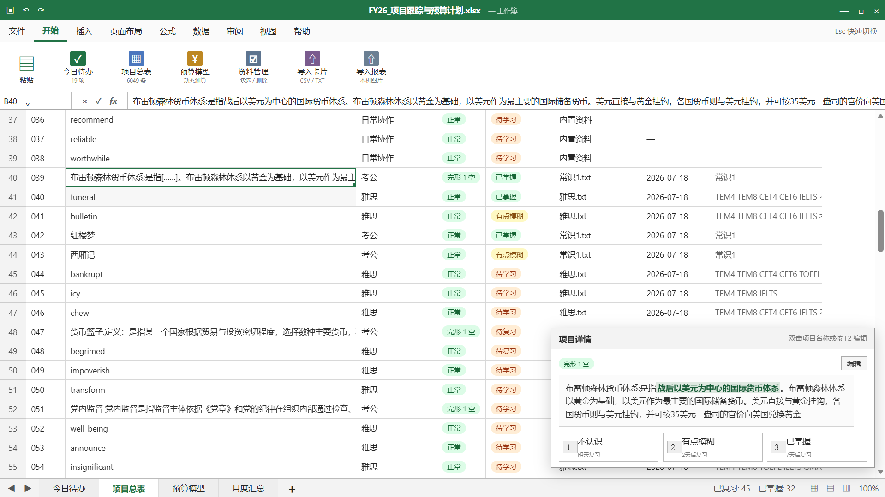

# Quiet Sheet

一个电子表格风格的本地学习工具，适合用来复习单词、考试知识点和其他问答式资料。

支持导入 Anki 导出的 TXT 文件，以及自定义 CSV、TSV、TXT 文件。无需注册账号，学习资料和进度默认保存在当前浏览器本机。

> 当前版本：v1.0 Beta（2026-07-19）

## 界面预览

## 主要功能

- 电子表格风格界面、紧凑功能区和全屏显示（双击顶部）
- 工作簿名称可在本机自定义（右键顶部名称）
- “今日待办”只显示到期复习与每日新卡，评估后自动移出
- 可按导入批次选择学习范围，并分别保存顺序或随机学习方式
- “项目总表”支持搜索、编辑、分类、批量选择和删除
- 支持 Anki 导出的 TXT，以及通用 CSV、TSV 导入、表头识别和字段映射
- 12MB 以上大文件提示，最大支持 50MB，并显示读取、解析和记录数量状态
- 自动识别 Anki 导出文件中的 GUID、笔记类型、牌组、标签等列元数据
- 支持 `{{c1::答案}}` 完形填空语法；每条源笔记只生成一张学习卡
- 支持段落、列表、表格、Ruby 注音、上下标、代码块和公式源码的轻量文本转换
- 自动清理媒体引用、外部样式和常见 HTML 标签
- 每次导入保存文件批次，可筛选或一键删除整个批次
- 可拖动并自动保存表格列宽
- 本地保存学习进度、导入卡片和小游戏最高分
- 支持自定义 PNG、JPG 或 WebP 工作报表封面
- 完全静态，不需要服务器或数据库

## 本地使用

请下载整个 `excel-learning-demo` 文件夹，然后双击 `index.html`。不要只复制 HTML 文件，因为页面还需要同目录中的 CSS 和 JavaScript 文件。

推荐使用最新版 Chrome 或 Microsoft Edge 桌面浏览器。当前版本主要面向桌面端，暂未针对手机屏幕进行完整适配。

更新后如果仍显示旧界面，请按 `Ctrl + F5` 强制刷新。

> [!IMPORTANT]
> 当前版本的数据仅保存在浏览器本机。清除浏览器网站数据、更换浏览器或更换设备后，卡片和学习进度不会自动迁移，请保留原始导入文件。

## 兼容 Anki 导出文件

本项目支持 Anki 导出的“笔记（纯文本）”以及 UTF-8 编码的 CSV、TSV、TXT 文件，暂不支持直接导入 `.apkg` 文件。

导入时，点击页面顶部的“导入卡片”，再选择对应的字段映射。

导入器支持：

- 自动识别兼容的 Anki 导出文件列说明
- 手动调整字段映射
- HTML 内容清理与纯文本转换
- 完形填空答案提取
- 重复内容更新、跳过或保留副本
- 保存文件名、导入时间和卡片数量等批次记录

旧版本已经导入的卡片没有保存原文件名，会统一显示为“历史导入”。新版本之后的每次导入会单独记录。

自定义导入文件必须至少包含正面（问题）和背面（答案）两列，并使用 UTF-8 编码保存。

## 今日待办

今日列表由两部分组成：

- 已到复习日期的卡片
- 当日新卡，默认上限为 20 张，可在页面中调整

完成一次评估后，卡片会从当天列表移出，并按照选择安排到 1、2 或 7 天后复习。每日新卡额度会扣除当天已经首次学习的新卡，不会在完成后自动补满。

## 数据与隐私

页面没有账号系统、第三方统计或外部脚本，也不会主动上传学习内容。卡片、学习记录、导入批次、列宽和游戏成绩均保存在当前浏览器本机。

请勿导入公司、客户或其他敏感资料，并遵守所在单位的设备和软件使用规定。

## 已知限制

- 暂不支持直接导入 Anki `.apkg` 文件
- 不导入 Anki 的复习历史和调度信息
- 暂不支持朗读、图片、音频或视频
- 只有媒体而没有有效文字的记录会在预览中标记并跳过
- 数据不支持跨浏览器或跨设备自动同步
- 完形填空笔记目前每条源笔记只生成一张学习卡
- 当前版本主要面向桌面端

## 版权与使用

Copyright © 2026 Quiet Sheet 项目作者。保留所有权利。

允许个人出于非商业目的免费使用、复制和修改本项目。

未经作者许可，不得出售本项目或其修改版本，不得用于收费服务、商业产品或其他商业用途。商业使用请联系作者获得授权。

第三方商标、文件格式及用户导入的内容归各自权利人所有。
